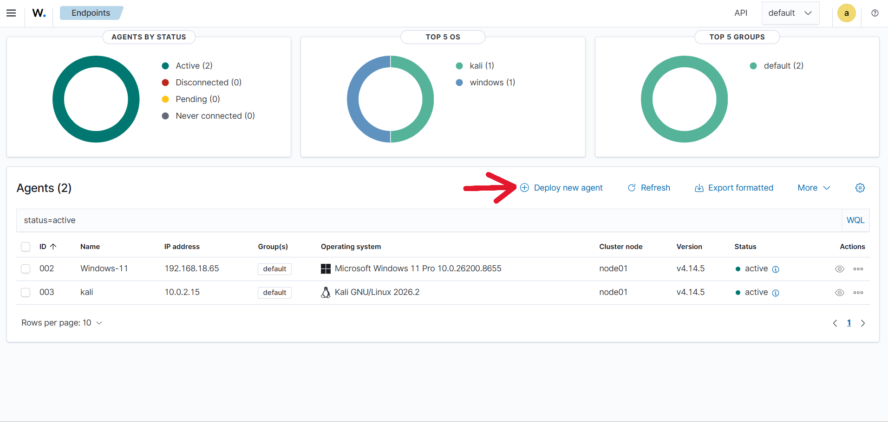
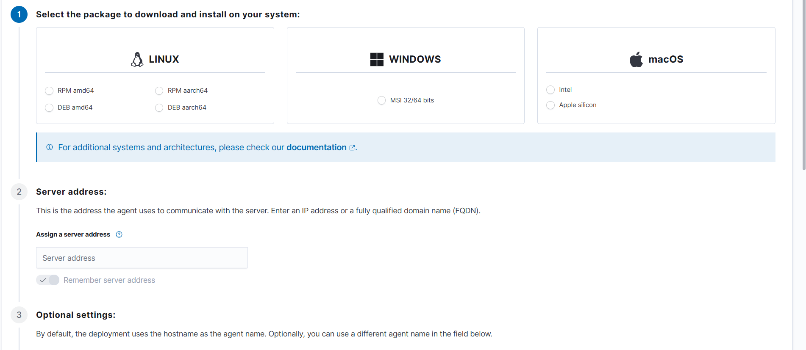
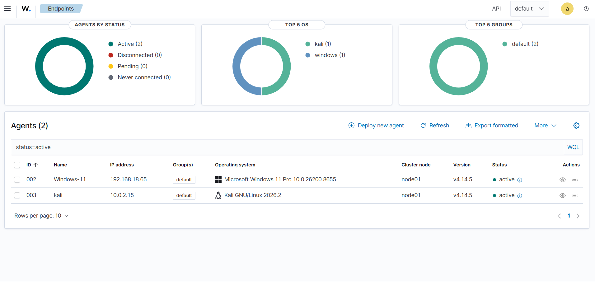
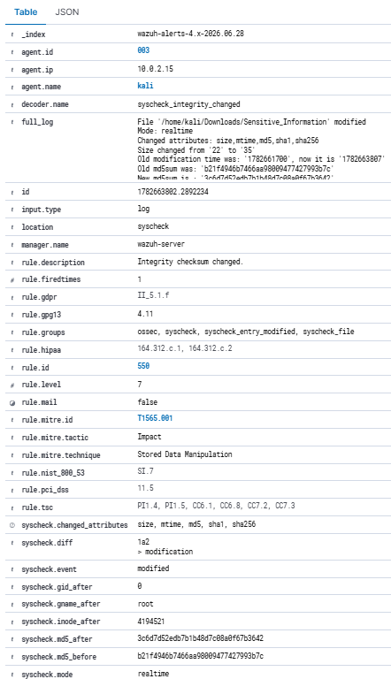
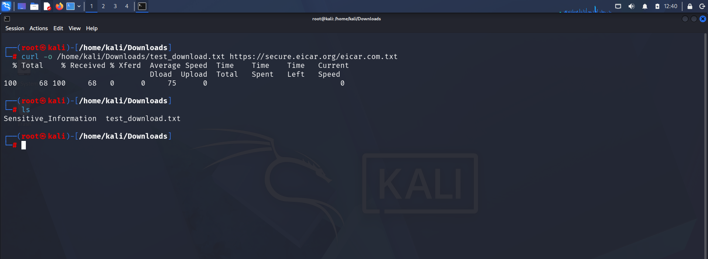
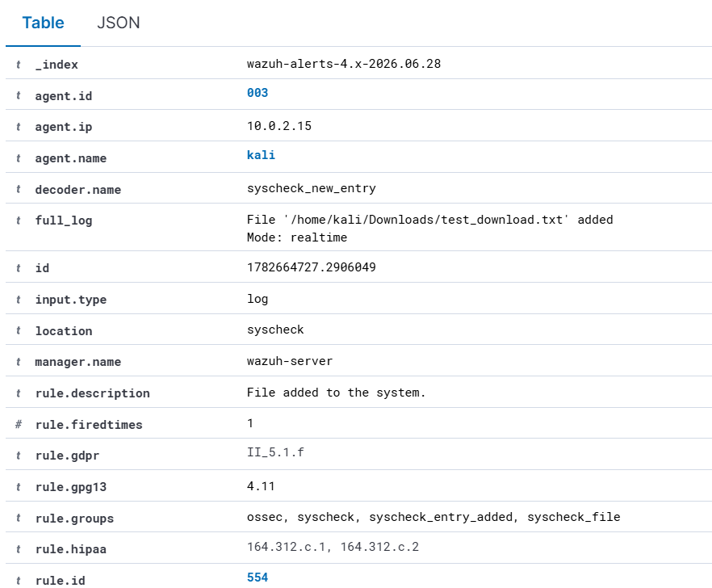

# Real-Time File Integrity Monitoring (FIM) Lab with Wazuh

This project demonstrates the setup and testing of a local Endpoint Detection and Response (EDR) lab environment using **Wazuh**.

The main objective was to configure **real-time File Integrity Monitoring (FIM)** on a Kali Linux endpoint to detect unauthorized file modifications, directory changes, and unexpected file downloads immediately.

---

## Project Objectives

This lab focuses on:

- Deploying and registering Wazuh agents with a centralized Wazuh Manager.
- Configuring File Integrity Monitoring using `ossec.conf`.
- Monitoring sensitive files and directories in real time.
- Simulating attacker behavior to validate detection capabilities.
- Investigating security alerts through the Wazuh dashboard.

---

# Lab Environment

| Component | Purpose |
|---|---|
| Wazuh Manager | Centralized SIEM/XDR platform |
| Kali Linux | Monitored endpoint with Wazuh Agent |
| Windows Endpoint | Additional monitored endpoint |
| Wazuh Dashboard | Alert monitoring and analysis |

---

# Phase 1: Deploying and Registering Wazuh Agent

The Wazuh dashboard deployment wizard was used to generate the agent installation command.

## Steps:

1. Open the Wazuh Dashboard.
2. Go to:

```
Agents → Deploy New Agent
```

3. Select the endpoint operating system.
4. Enter the Wazuh Manager IP address.
5. Copy the generated installation command.
6. Execute the command on the endpoint.

After installation, the endpoints successfully connected with the Wazuh Manager.

Agent communication was verified from the dashboard.



*Figure 1: Deploying Wazuh Agent.*



*Figure 2: Generating the agent deployment command.*



*Figure 3: Verifying active Wazuh agents.*

---

# Phase 2: Configuring Real-Time File Integrity Monitoring

Wazuh already monitors several important system directories by default. 

For this lab, custom monitoring was added to simulate a corporate environment.

The monitored directory:

```bash
/home/kali/Downloads
```

The sensitive file:

```bash
/home/kali/Downloads/Sensitive_Information
```

Edit the Wazuh agent configuration:

```bash
sudo nano /var/ossec/etc/ossec.conf
```

Add the following configuration inside the `<syscheck>` section:

```xml
<syscheck>

  <directories realtime="yes">
    /home/kali/Downloads
  </directories>

  <directories realtime="yes" report_changes="yes">
    /home/kali/Downloads/Sensitive_Information
  </directories>

</syscheck>
```

Restart the Wazuh agent:

```bash
sudo systemctl restart wazuh-agent
```

---

# Testing Phase

The File Integrity Monitoring configuration was tested using two attack simulations:

1. Unauthorized file modification.
2. Suspicious file download.

---

# Test Case 1: Simulating File Tampering

Attackers may modify important files after gaining access to a system.

To simulate this activity:

```bash
nano /home/kali/Downloads/Sensitive_Information
```

Add an unauthorized change:

```
Unauthorized modification detected
```

Save the file.

---

## Wazuh Detection

The Wazuh Dashboard generated an alert:

- Rule ID: **550**
- Alert: **Integrity checksum changed**
- MITRE ATT&CK:

```
T1565.001 - Stored Data Manipulation
```



*Figure 4: Wazuh detecting unauthorized file modification.*

---

# Test Case 2: Simulating Suspicious File Download

Attackers commonly use command-line tools such as:

- curl
- wget

to download files into user directories.

The following command downloads the EICAR test file:

```bash
curl -o /home/kali/Downloads/test_download.txt https://secure.eicar.org/eicar.com.txt
```

Because the Downloads directory is monitored in real time, Wazuh detects the new file creation.



*Figure 5: Downloading a test file using curl.*

---

## Wazuh Detection

The dashboard displays a new file creation alert.



*Figure 6: Wazuh detecting the downloaded file.*

---

# Results

The lab successfully demonstrated:

✅ Wazuh Agent deployment  
✅ Endpoint registration  
✅ Real-time File Integrity Monitoring  
✅ Detection of unauthorized file changes  
✅ Detection of new file creation events  
✅ Security alert investigation  

---

# Conclusion

This project provided hands-on experience building a lightweight EDR monitoring environment using Wazuh.

The configured FIM rules successfully detected simulated attacker activities such as:

- File tampering
- Unauthorized modifications
- Suspicious downloads

Future improvements:

- Custom Wazuh detection rules
- Active response automation
- Additional MITRE ATT&CK detections
- Multiple endpoint monitoring

