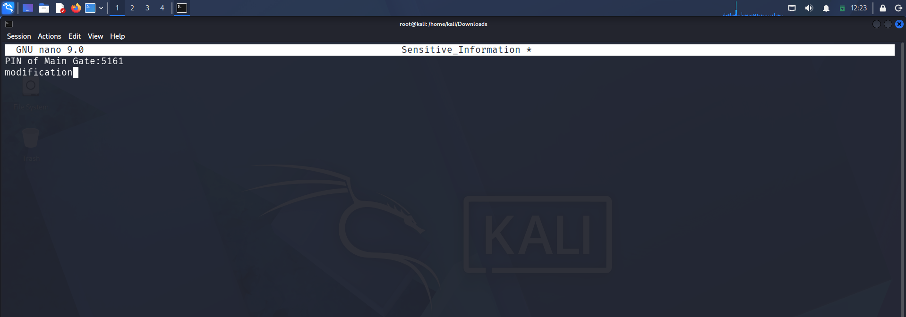

# Building a Real-Time File Integrity Monitoring (FIM) Lab with Wazuh

This project captures my hands-on setup of a local Endpoint Detection and Response (EDR) lab environment using Wazuh. The main goal was to configure and test real-time File Integrity Monitoring (FIM) on a Linux client (Kali Linux) to catch unauthorized system changes, file modifications, and unexpected downloads the exact second they happen.

## Why Build This?
Monitoring critical system paths and sensitive corporate directories is one of the quickest ways to spot an early-stage intrusion. By setting up this lab, I wanted to get practical experience with:
1. Deploying and registering EDR agents with a centralized manager.
2. Tuning agent configuration files (`ossec.conf`) to watch specific high-risk paths.
3. Simulating typical attacker behavior (tampering with configuration data and pulling down files via command-line utilities) to make sure the alerts actually fire.

---

## Setting Up the Infrastructure

### Phase 1: Deploying and Registering the Agent
I started by utilizing the deployment wizard within the Wazuh dashboard to generate a clean installation package for my endpoints. The interface lets you select the target OS architecture and point the agent back to the Wazuh Manager's private IP address.


*Figure 1: Deploying Agent.*

 Click on the Deploy New Agent to Deploy Agent 


*Figure 3: Walking through the agent setup wizard in the central console.*

Select the endpoint and then enter the Wazuh-Manager IP in the Server's IP section.Then the script will appear run that script using powershell and then run the commands that present at the last of this page. Once the installation commands were executed on the endpoint machines, they checked back into the environment and established a stable connection over port 1514 (TCP). I verified that both my Windows and Linux target endpoints were showing up as active on the central dashboard.


*Figure 3: Verifying that endpoints are successfully checking in and active.*

---

## Customizing the FIM Configuration

By default, Wazuh tracks a lot of standard directories (like `/etc` or `/bin`), but I wanted to implement targeted monitoring over a simulated corporate folder structure. I added a custom rule to the agent's `/var/ossec/etc/ossec.conf` file to watch a specific `Downloads` path and a highly critical file named `Sensitive_Information`.

Here are the exact configurations I appended to the `<syscheck>` block:

```xml
<syscheck>
   <directories realtime="yes">/home/kali/Downloads</directories>
   <directories realtime="yes" report_changes="yes">/home/kali/Downloads/Sensitive_Information</directories>
</syscheck># Wazuh-realtime-fim-project

Implementing real-time File Integrity Monitoring (FIM) using a Wazuh  agent on Kali Linux to track unauthorized file modifications and directory creations.

##  Executing the Testing Phase

To validate that our File Integrity Monitoring (FIM) configurations work effectively, we need to manually trigger and document the detection capabilities. Testing is split into two simulated attack vectors: asset tampering (unauthorized modifications) and staging discovery (unauthorized downloads).

### Test Case 1: Simulating Asset Tampering
In a real-world breach, attackers or rogue insiders might modify system files, configuration files, or local application data. To simulate this behavior on our endpoint, we manually append an unauthorized data string to our protected database asset using the terminal or an editor.


*Figure 4: Highlights using the nano editor to add an unauthorized text string mutation ("modification") to our protected database asset.*

**SIEM Verification:** Head over to your Wazuh Dashboard under the Threat Hunting module. Look for a high-severity alert triggering **Rule ID 550** (*Integrity checksum changed*).


*Figure 5: captures the generated log overview in the dashboard, showing that the agent instantly flagged the mutation and mapped it straight to MITRE ATT&CK Tactic T1565.001 (Stored Data Manipulation).*

---

### Test Case 2: Simulating Malicious Tool Ingestion
Attackers frequently leverage built-in command-line utilities like `curl` or `wget` to pull down malicious payloads, web shells, or staging scripts into easy-to-reach user spaces like the `Downloads` directory. We can run a web request on our client machine to verify if our directory-level monitoring policy catches this footprint.


*Figure 6: Using the curl downloading the suspicious.*

```bash
curl -o /home/kali/Downloads/test_download.txt [https://secure.eicar.org/eicar.com.txt](https://secure.eicar.org/eicar.com.txt)


*Figure 7: captures the generated log overview in the dashboard, showing that the agent instantly flagged the addition of file.*
